# Time Series Analysis
# Strategic Insights Across Office Supplies, Furniture and Technology Sales

## Solution Overview:
This project delivers a validated forecasting solution for three key products: Office Supplies, Furniture and Sales using SARIMA and Prophet models. 

The goal is to provide reliable strategic planning through accurate, interpretable forecasts.
* **SARIMA RMSE**: £332.37
* **Daily Sales Range**: £10,140.57
Forecast error is just **3.3%** of observed range, ideal for operational decisions.
* **Forecast Horizon**: 36 months
* **Validated on**: 6-month test window
* **Peak Month (Office Supplies)**: December 2016 (Average Monthly Sales: £1,357.06) 
* **Peak Month (Furniture)**: January 2016 (Average Monthly Sales: £782.66)
* **Peak Month (Technology)**: March 2014 (Average Monthly Sales: £1,477.78)

## Business Impact:
* **Inventory Optimization:** Validated forecasts reveal seasonal demand spikes, especially in Q4 for Office Supplies and Q1 for Furniture enabling precise stock planning and reduced overstock risk.
* **Executive Reporting:** Visuals are designed for clarity, translating RMSE, sales ranges and forecast uncertainty into digestible insights for non-technical stakeholders.
* **Category-wise Strategy:** Comparative trend analysis across various categories uncovers distinct sales behaviours:
  -  Office Supplies: Seasonal surges suggests tactical promotions
  -  Furniture: Overall stable growth suggests long-term contracts
  -  Technology: Volatile peaks suggests agile inventory and marketing

    ## Office Supplies Sales
To understand historical data regarding Office Supplies, this visual effectively compares raw monthly sales with a 3-month rolling average. It reveals underlying trends and smoothes out short-term fluctuations in Office Supplies demand.
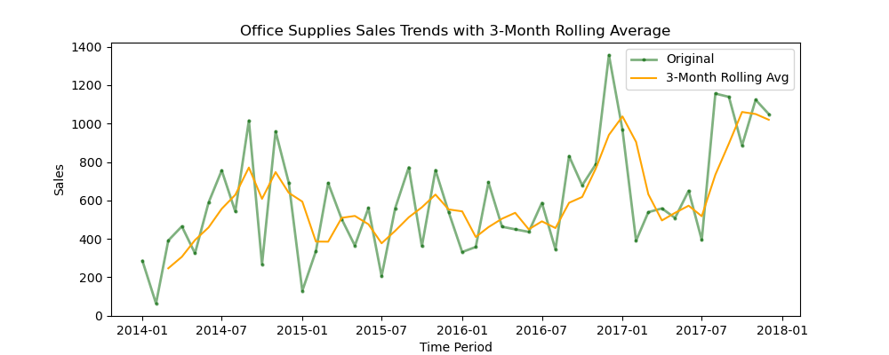

### Office Supplies Heatmap

Monthly sales heatmap revealing seasonal spikes in Office Supplies, with consistent Q4 surges and year-over-year growth patterns. This visual is ideal for identifying peak demand periods and planning inventory cycles.
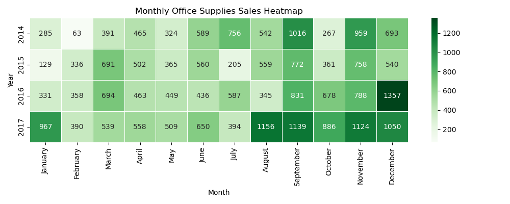

### SARIMA Model Diagnostics for Office Supplies

The diagnostics validate the model's reliablity through residual analysis, mormality checks, and autocorrelation plots. SARIMA is used for forecasting time series data with seasonality like monthly office supplies sales.

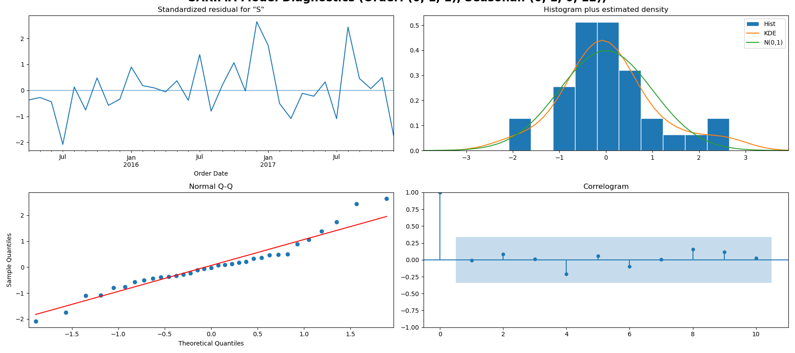

### Forecast Error vs Daily Sales Range
This visual highlights the SARIMA model's precision-forecast error is just 3.3% of the observed daily sales range. 

.png)

### Forecast for Office Supplies
This visual shows seasonal patterns in office supplies sales, with forecast accuracy validated over a six-month test window.  As forecasts extend further into the future, the model’s confidence intervals widen, reflecting a natural increase in uncertainty while maintaining credible directional insights.

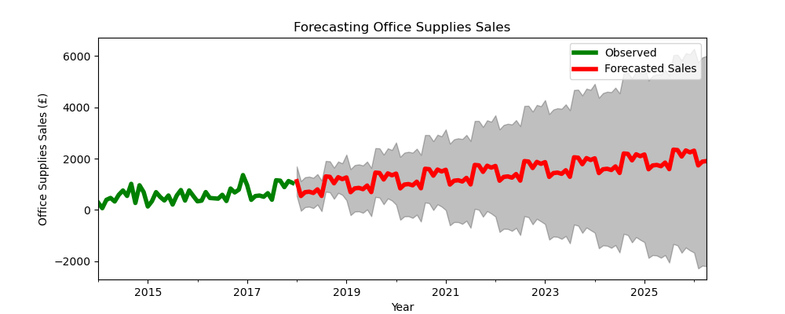

### Monthly Sales Forecast for Office Supplies Using Prophet
Prophet model captures seasonal patterns and long-term trends in Office supplies sales, offering a 3-year forecast with interpretable uncertainty bands.

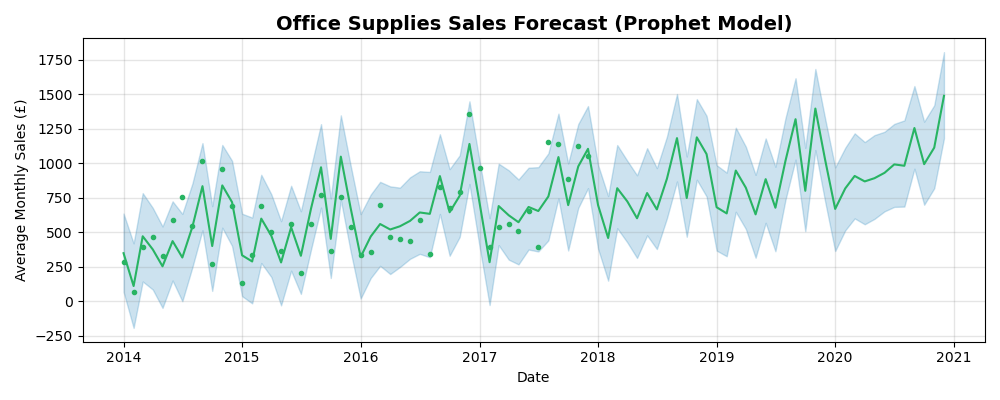

## Furniture Sales
Visual showing seasonal patterns in furniture sales through a heatmap.

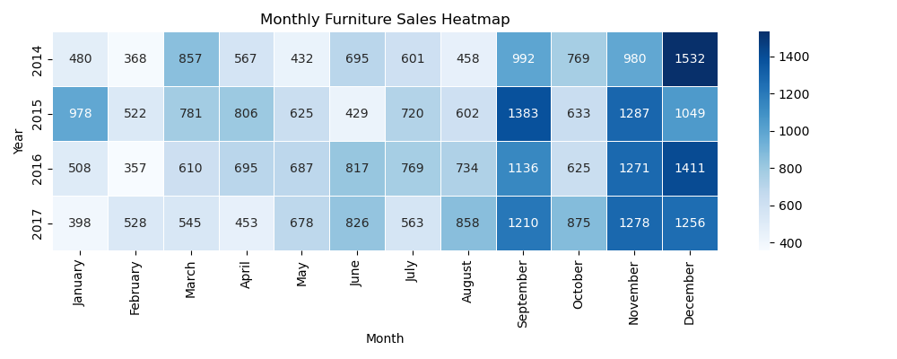

Visual capturing forecast for Furniture sales with Prophet Model.

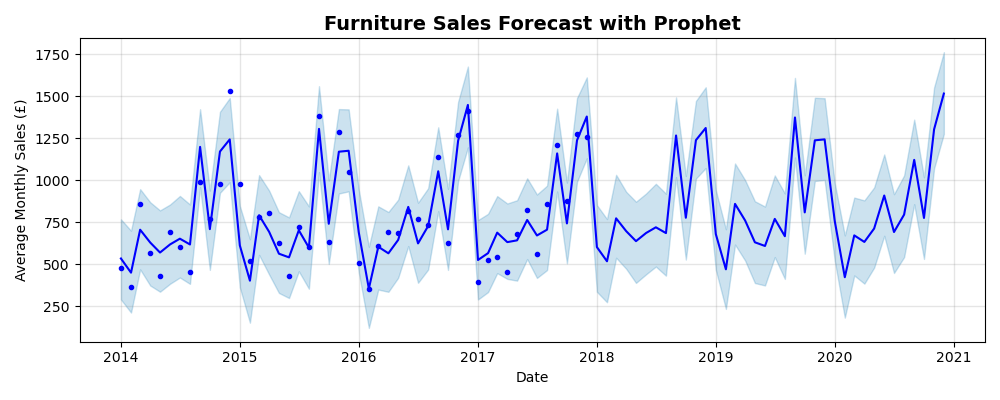

Furniture shows a steady upward trend with moderate seasonality. Peaks are visible aroung Q4, likely driven by year-end procurement or budget cycles. Overall it has stable revenue stream and is good for long-term contracts.

## Technology Sales

Monthly sales heatmap for Technology reveals variable demand patterns with sharp spikes. This volatility underscores the need for agile inventory systems and responsive marketing.

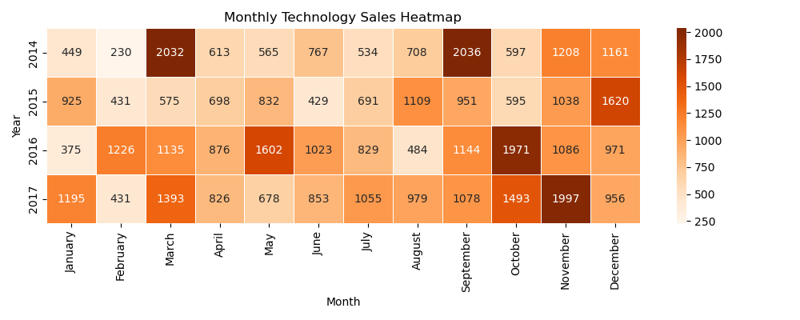

### Technology Sales Forecast with Prophet Model
Prophet model forecasts Technology sales with wide uncertainty bands, reflecting high volatility and unpredictable demand spikes.
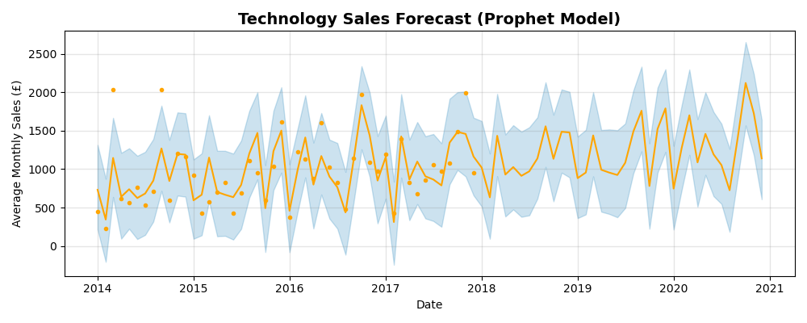

# Comparison Across Categories
### Monthly Sales Comparison Across Categories

Line plot comparing monthly average sales across Office Supplies, Furniture and Technology. The analysis reveals distinct seasonal patterns and volatility levels. Office supplies is in high demand in Q4, Furniture remains steady, and Technology shows erratic surges.

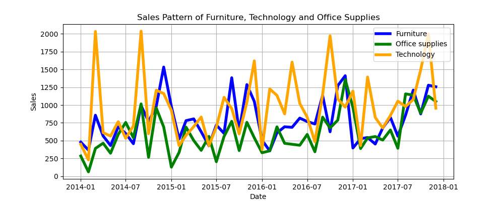

### Forcasted Sales by Category using Prophet Model
Next, the visual shows Prophet-generated forecasts for all three categories over a 3-year horizon. This is useful for strategic planning and risk assessment.
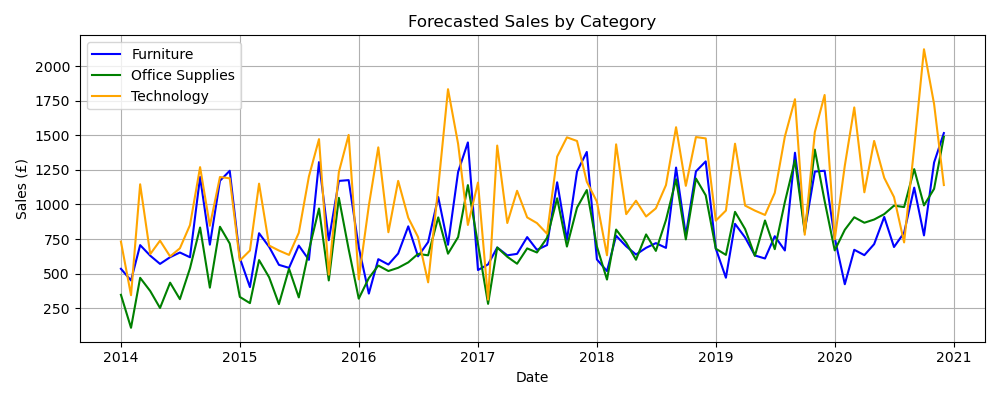

### Furniture vs Office Supplies Sales Trends
Trend comparison showing Furniture's stable growth vs Office Supplies' seasonal spikes. This visual is ideal for contrasting long-term procurement with tactical inventory planning.

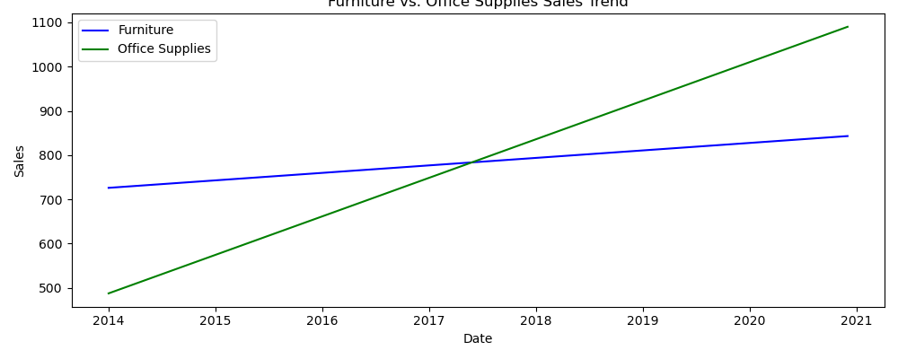

### Technology vs Office Supplies Sales Trends
Comparing Technology sales with Office supplies reveals distinct demand patterns. While Office supplies follow predictable seasonal cycles, Technology sales are volatile and spike unpredictably. This contrast highlights the need for more tactical marketing strategies and flexible inventory planning in the tech category.

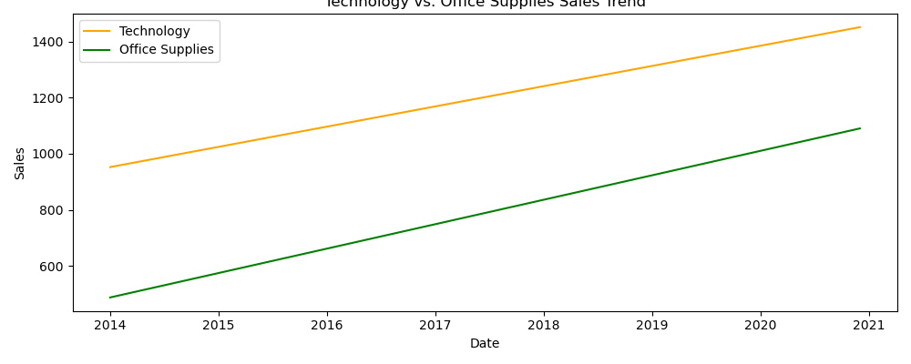

Our time series models forecast category-level sales with high precision and clear seasonal patterns. Office Supplies show strong Q4 spikes, Technology is volatile but high-yield, and Furniture remains stable. Forecast confidence intervals are tight for the next 6–12 months, supporting reliable planning. These insights enable targeted inventory, marketing, and procurement strategies across categories.
