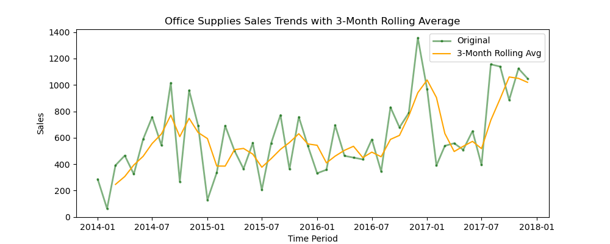
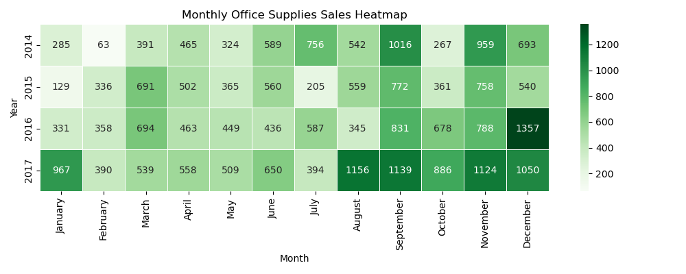
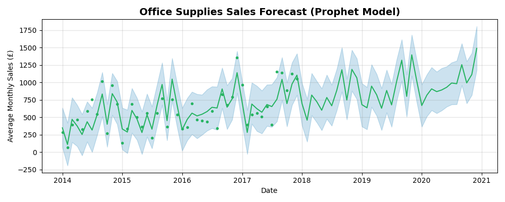
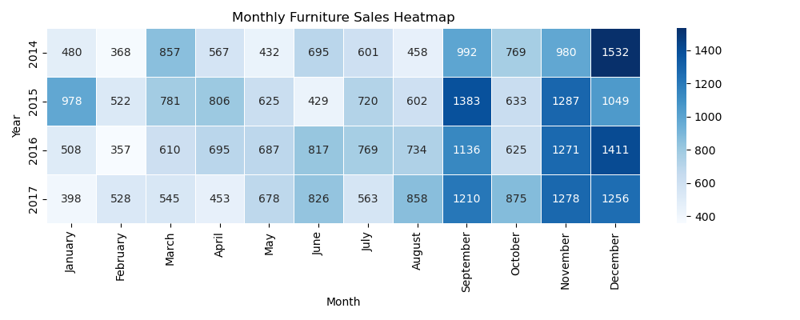
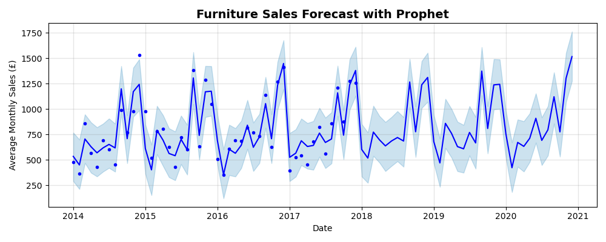
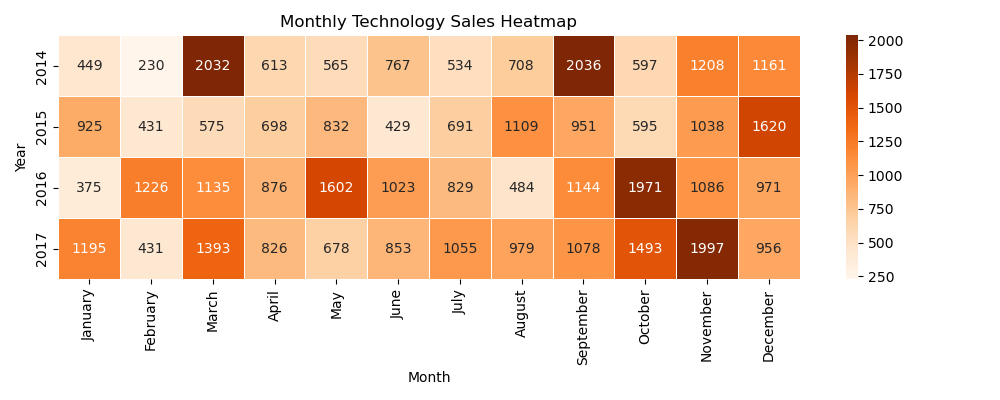
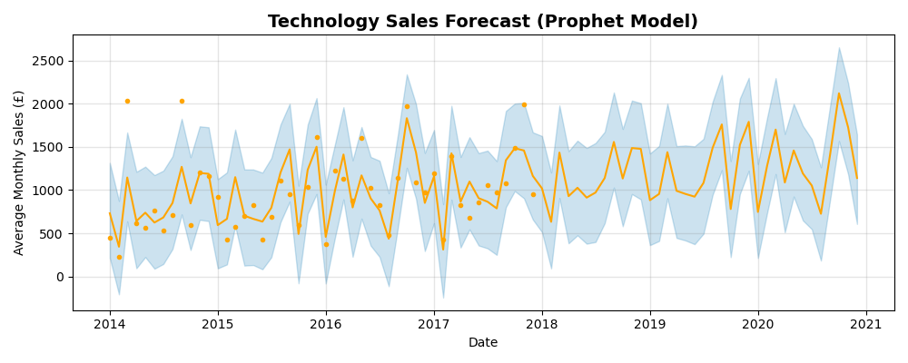

# Strategic Insights Across Office Supplies, Furniture and Technology Sales

## Solution Overview:
This project delivers a validated forecasting solution for three key products: Office Supplies, Furniture and Sales using SARIMA and Prophet models. 

The goal is to provide reliable strategic planning through accurate, interpretable forecasts.
* **SARIMA RMSE**: £332.37
* **Daily Sales Range**: £10,140.57
Forecast error is just **3.3%** of observed range, ideal for operational decisions.
* **Forecast Horizon**: 36 months
* **Validated on**: 6-month test window
* **Peak Month (Office Supplies)**: December 2016 (Average Monthly Sales: £1,357.06)
* **Peak Month (Furniture)**: January 2016 (Average Monthly Sales: £782.66)
* **Peak Month (Technology)**: March 2014 (Average Monthly Sales: £1,477.78)

## Business Impact:
* **Inventory Optimization:** Validated forecasts reveal seasonal demand spikes, especially in Q4 for Office Supplies and Q1 for Furniture enabling precise stock planning and reduced overstock risk.
* **Executive Reporting:** Visuals are designed for clarity, translating RMSE, sales ranges and forecast uncertainty into digestible insights for non-technical stakeholders.
* **Category-wise Strategy:** Comparative trend analysis across various categories uncovers distinct sales behaviours:
  -  Office Supplies: Seasonal surges suggests tactical promotions
  -  Furniture: Overall stable growth suggests long-term contracts
  -  Technology: Volatile peaks suggests agile inventory and marketing

    ## Office Supplies Sales
Plot compares raw monthly sales with a 3-month rolling average, revealing underlying trends and smoothing out short-term fluctuations in Office Supplies demand.

### Forecast Error vs Daily Sales Range
This visual highlights the SARIMA model's precision-forecast error is just 3.3% of the observed daily sales range.
.png)

### Forecast for Office Supplies
This visual shows seasonal patterns in office supplies sales, with forecast accuracy validated over a six-month test window.  As forecasts extend further into the future, the model’s confidence intervals widen, reflecting a natural increase in uncertainty while maintaining credible directional insights.

### Office Supplies Heatmap
Monthly sales heatmap revealing seasonal spikes in Office Supplies, with consistent Q4 surges and year-over-year growth patterns. This visual is ideal for identifying peak demand periods and planning inventory cycles.

### Monthly Sales Forecast for Office Supplies Using Prophet
Prophet model captures seasonal patterns and long-term trends in Office supplies sales, offering a 3-year forecast with interpretable uncertainty bands.

## Furniture Sales
Visual showing seasonal patterns in furniture sales through a heatmap.

Visual capturing forecast for Furniture sales with Prophet Model.

## Technology Sales

# Category Comparison
![Sales Comparison across categories(category-comparison-sales.png)
