# Time Series Sales Analysis
### Full SARIMA and Prophet modelling pipeline across three product categories. Foundation for live forecasting dashboard


---

## At a Glance

| | |
|---|---|
| **Dataset** | Superstore Sales - 9,994 transactions across 4 years |
| **Scope** | Three categories: Office Supplies, Furniture, Technology |
| **Models** | SARIMA (grid search, AIC-selected) and Facebook Prophet |
| **Forecast horizon** | 36 months with 95% confidence intervals |
| **Validation** | 6-month hold-out test window |
| **SARIMA accuracy** | RMSE £332.37 - 3.3% of observed daily sales range |
| **Output** | Pre-computed forecast CSVs consumed by live Streamlit dashboard |

---

## Project Overview

This notebook delivers the full analytical and modelling pipeline 
for a validated sales forecasting solution across three product 
categories. Both SARIMA and Prophet models are trained, evaluated, 
and compared on the same hold-out window.

Forecast outputs are exported as structured CSVs and consumed by 
a decoupled Streamlit dashboard reflecting a two-tier production 
architecture where the modelling layer and presentation layer are 
always separated.

**This is Part 1 of a two-part project. See the live dashboard in 
the Related Projects section below.**

---

## Modelling Pipeline

### Data Preparation
- 9,994 transactions aggregated to monthly frequency per category
- Missing months imputed with category median
- Stationarity tested using Augmented Dickey-Fuller test

### SARIMA
- Grid search over (p,d,q)(P,D,Q,s) parameter space
- Model selected by minimising AIC across validation window
- Residual diagnostics: normality, autocorrelation, heteroscedasticity
- RMSE: £332.37 (3.3% of observed daily sales range)

### Facebook Prophet
- Additive seasonality with yearly components
- Automatic changepoint detection for trend shifts
- Uncertainty intervals at 95% confidence level
- 36-month forecast horizon

### Model Selection Rationale
Both models were evaluated on the same 6-month hold-out window. 
Prophet was selected as the primary forecast output for the 
dashboard due to its superior handling of irregular seasonality 
and automatic uncertainty quantification both critical for 
business planning applications.

---

## Results by Category

| Category | Peak Month | Avg Monthly Sales | Pattern | Strategic Recommendation |
|----------|-----------|-------------------|---------|--------------------------|
| Office Supplies | December | £1,357 | Strong Q4 seasonality | Tactical Q3 stock build |
| Furniture | January | £783 | Stable upward trend | Long-term procurement contracts |
| Technology | March | £1,478 | High volatility | Agile inventory management |

Confidence window: 6-12 months for operational decisions, 
24-36 months for strategic directional planning only.

---

## Analysis - Office Supplies

Office Supplies is the primary focus of this analysis, with 
Furniture and Technology included for cross-category comparison.

### Sales trend with rolling average
Raw monthly sales compared with a 3-month rolling average to 
reveal underlying trends and smooth short-term fluctuations.

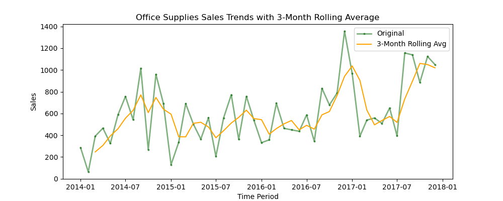

### Seasonal heatmap
Monthly heatmap revealing consistent Q4 demand surges and 
year-over-year growth. Useful for identifying peak periods 
and planning inventory cycles.

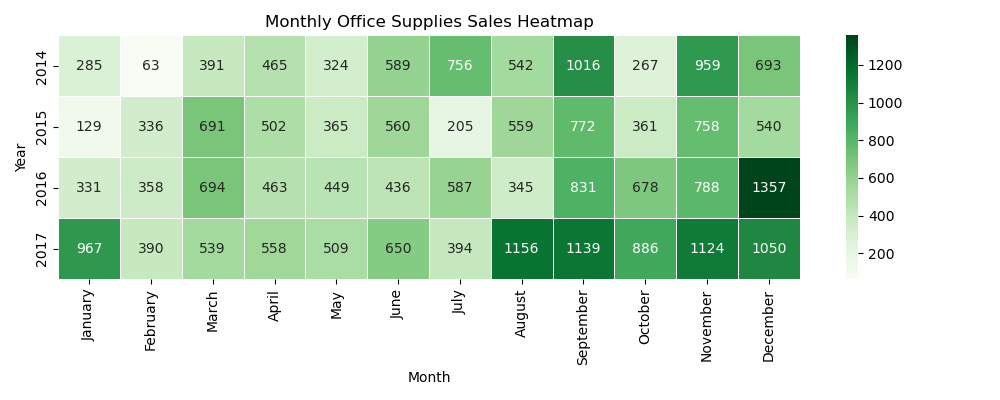

### SARIMA model diagnostics
Residual analysis, normality checks, and autocorrelation plots 
confirming model reliability before forecast generation.

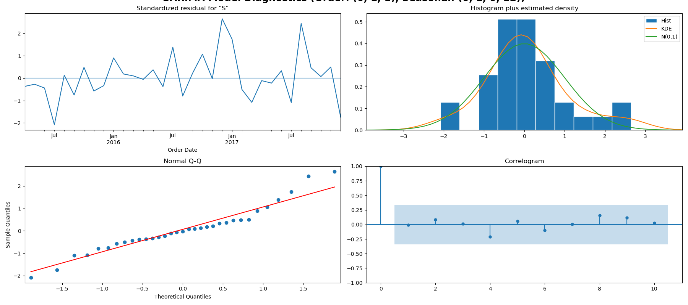

### SARIMA forecast
Seasonal patterns validated over a 6-month test window. 
Confidence intervals widen appropriately over longer horizons, 
reflecting increasing uncertainty while maintaining directional 
credibility.

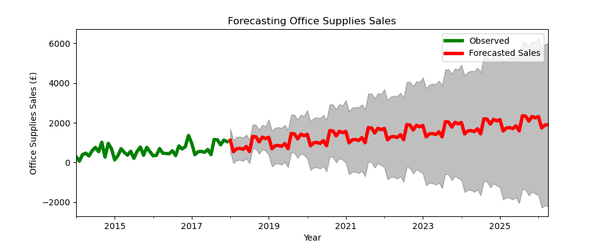

### Forecast error vs daily sales range
SARIMA forecast error of £332.37 represents 3.3% of the 
observed daily sales range confirming precision suitable 
for operational planning decisions.

.png)

### Prophet forecast
Prophet model capturing seasonal patterns and long-term trends 
with interpretable uncertainty bands across a 36-month horizon.

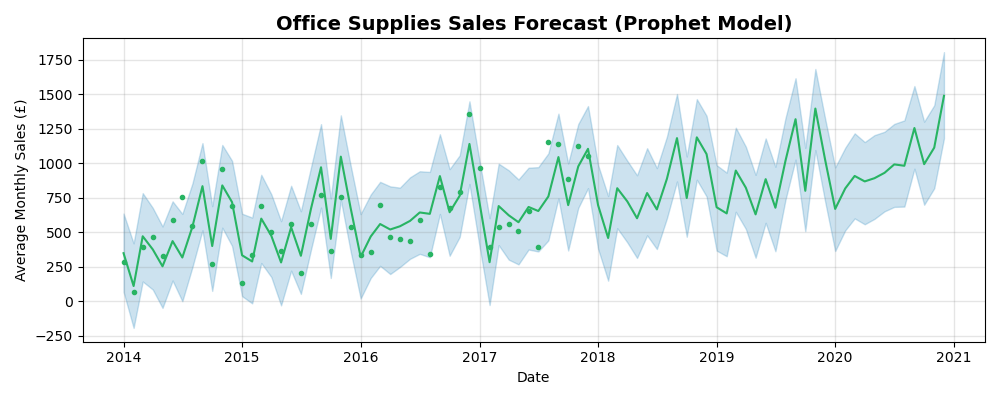

---

## Cross-Category Comparison

### Furniture
Stable upward trend with moderate seasonality. Q4 peaks likely 
driven by year-end procurement cycles. Suited to long-term 
contract planning rather than tactical stock management.

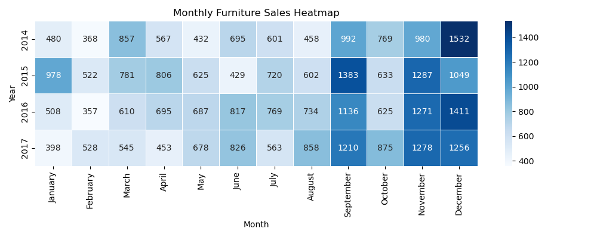
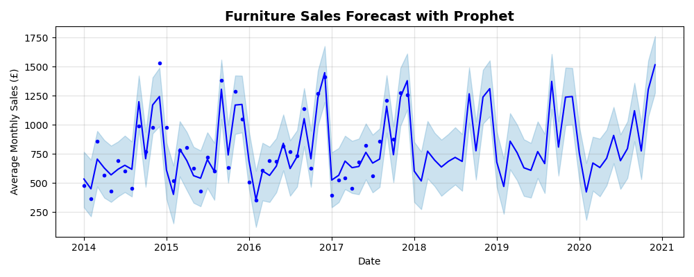

### Technology
High volatility with unpredictable demand spikes. Wide 
Prophet uncertainty bands reflect the category's erratic 
nature. Requires agile inventory systems and responsive 
marketing rather than fixed procurement schedules.

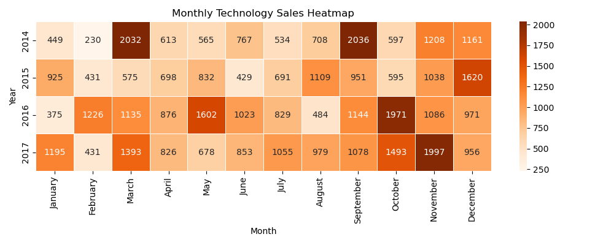
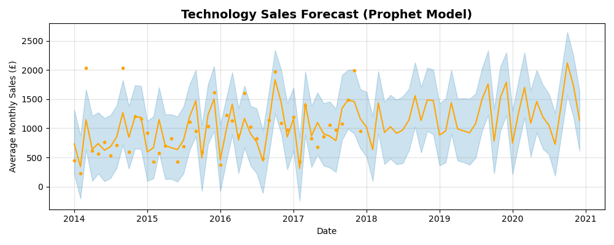

### Monthly sales comparison across all categories
Line plot showing distinct seasonal patterns and volatility 
levels across all three categories. Q4 concentration in 
Office Supplies, stability in Furniture, erratic surges 
in Technology.

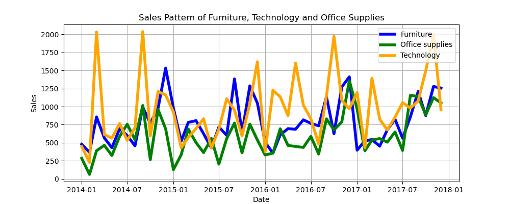

### 36-month Prophet forecasts by category
Comparative forecast across all three categories for 
strategic planning and risk assessment.

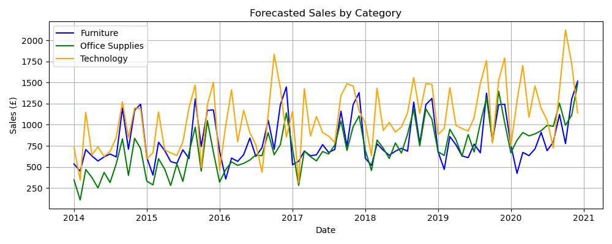

### Furniture vs Office Supplies trend
Contrasting Furniture's stable growth with Office Supplies' 
seasonal spikes illustrating the difference between 
long-term procurement and tactical inventory planning.

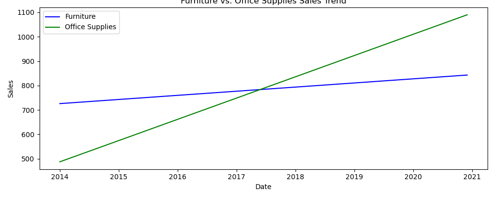

### Technology vs Office Supplies trend
Technology's unpredictable spikes against Office Supplies' 
predictable seasonal cycles highlighting the need for 
distinct inventory and marketing strategies per category.

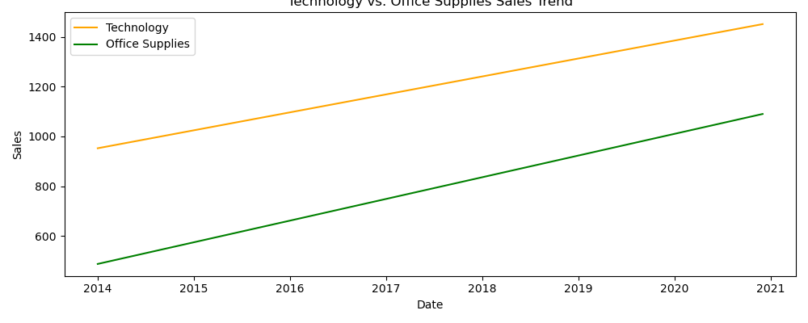

---

## Business Impact

**Inventory optimisation:** Validated seasonal patterns enable 
precise stock planning and reduced overstock risk, particularly 
Q4 for Office Supplies and Q1 for Furniture.

**Cross-category strategy:** Distinct demand behaviours across 
three categories support differentiated procurement approaches: 
tactical for Office Supplies, contractual for Furniture, 
flexible for Technology.

**Executive-ready output:** Forecast uncertainty expressed as 
confidence intervals rather than raw error metrics, translating 
model outputs into actionable planning guidance for non-technical 
stakeholders.

---

## Skills Demonstrated

`Python` `SARIMA` `Facebook Prophet` `Statsmodels` `Pandas` `NumPy`  
`Matplotlib` `Seaborn` `Time Series Analysis` `Seasonal Decomposition`  
`Stationarity Testing` `Augmented Dickey-Fuller` `Grid Search`  
`AIC Model Selection` `Residual Diagnostics` `Hold-out Validation`  
`Uncertainty Quantification` `Demand Forecasting` `Rolling Average`  
`Cross-Category Analysis` `Business Intelligence` `Strategic Planning`  
`Production ML Architecture` `ISO 42001` `Responsible AI`

---

## Related Projects

**Part 2 - Live Dashboard:**
[Sales Forecasting Dashboard](https://github.com/zubeen84/sales_forecasting_dashboard) 
- Streamlit and Plotly dashboard consuming forecast outputs 
from this notebook

[Live App](https://salesforecastingdashboard-2rhmw5d3ejmqsnbxrbmu9j.streamlit.app/)

**Other projects:**
[Diabetes Risk Predictor](https://github.com/zubeen84/diabetes_risk_predictor) 
- Live ML classification app with ISO 42001 governance

---

## Run Locally

```bash
git clone https://github.com/zubeen84/Time-Series-Sales-Analysis.git
cd Time-Series-Sales-Analysis
pip install -r requirements.txt
jupyter notebook
```

---

## Disclaimer

Forecasts are generated from historical sales patterns and are 
provided for planning purposes only. They do not constitute 
financial or procurement advice. Always validate against current 
market conditions and domain expertise before making operational 
decisions.

---

## Author

**Zubeen Khalid**
MSc Applied Data Science - Anglia Ruskin University
ISO 42001 Certified | AI+ Foundation | Prompt Engineering Level 1

[LinkedIn](https://www.linkedin.com/in/zubeenkhalid) · 
[GitHub](https://github.com/zubeen84)
